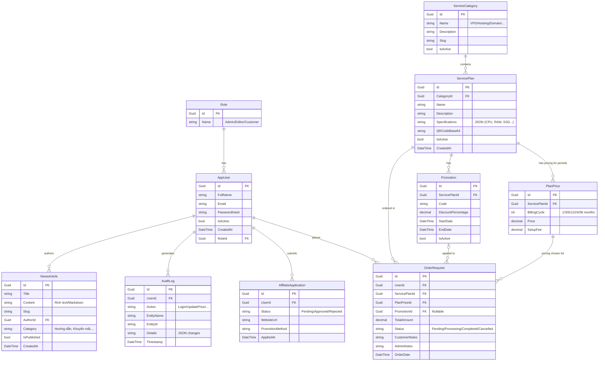

# Sơ đồ Thực thể Liên kết (ERD) - Cloud Service Solution

Sơ đồ này mô tả cấu trúc cơ sở dữ liệu cho hệ thống bán dịch vụ Cloud (VPS, Hosting, Domain).

```mermaid
erDiagram
    Role ||--o{ AppUser : "has"
    AppUser ||--o{ OrderRequest : "places"
    AppUser ||--o{ AffiliateApplication : "submits"
    AppUser ||--o{ AuditLog : "generates"
    
    ServiceCategory ||--o{ ServicePlan : "contains"
    ServicePlan ||--o{ PlanPrice : "has pricing for periods"
    ServicePlan ||--o{ Promotion : "has"
    
    ServicePlan ||--o{ OrderRequest : "ordered in"
    PlanPrice ||--o{ OrderRequest : "pricing chosen for"
    Promotion |o--o{ OrderRequest : "applied to"
    
    AppUser ||--o{ NewsArticle : "authors"

    AppUser {
        Guid Id PK
        string FullName
        string Email
        string PasswordHash
        bool IsActive
        DateTime CreatedAt
        Guid RoleId FK
    }

    Role {
        Guid Id PK
        string Name "Admin/Editor/Customer"
    }

    ServiceCategory {
        Guid Id PK
        string Name "VPS/Hosting/Domain/..."
        string Description
        string Slug
        bool IsActive
    }

    ServicePlan {
        Guid Id PK
        Guid CategoryId FK
        string Name
        string Description
        string Specifications "JSON (CPU, RAM, SSD...)"
        string QRCodeBase64
        bool IsActive
        DateTime CreatedAt
    }

    PlanPrice {
        Guid Id PK
        Guid ServicePlanId FK
        int BillingCycle "1/3/6/12/24/36 months"
        decimal Price
        decimal SetupFee
    }

    Promotion {
        Guid Id PK
        Guid ServicePlanId FK
        string Code
        decimal DiscountPercentage
        DateTime StartDate
        DateTime EndDate
        bool IsActive
    }

    OrderRequest {
        Guid Id PK
        Guid UserId FK
        Guid ServicePlanId FK
        Guid PlanPriceId FK
        Guid PromotionId FK "Nullable"
        decimal TotalAmount
        string Status "Pending/Processing/Completed/Cancelled"
        string CustomerNotes
        string AdminNotes
        DateTime OrderDate
    }

    NewsArticle {
        Guid Id PK
        string Title
        string Content "Rich text/Markdown"
        string Slug
        Guid AuthorId FK
        string Category "Hướng dẫn, Khuyến mãi,..."
        bool IsPublished
        DateTime CreatedAt
    }

    AffiliateApplication {
        Guid Id PK
        Guid UserId FK
        string Status "Pending/Approved/Rejected"
        string WebsiteUrl
        string PromotionMethod
        DateTime AppliedAt
    }

    AuditLog {
        Guid Id PK
        Guid UserId FK
        string Action "Login/UpdatePrice/..."
        string EntityName
        string EntityId
        string Details "JSON changes"
        DateTime Timestamp
    }
```
